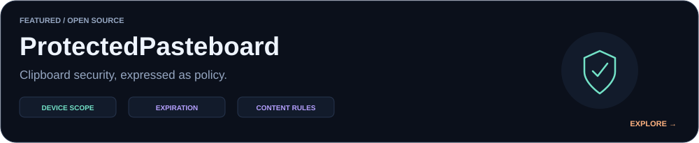

<picture>
  <source media="(max-width: 600px) and (prefers-color-scheme: light)" srcset="./assets/cover-light-mobile.svg" />
  <source media="(max-width: 600px)" srcset="./assets/cover-dark-mobile.svg" />
  <source media="(prefers-color-scheme: light)" srcset="./assets/cover-light.svg" />
  
</picture>

  <a href="https://www.linkedin.com/in/artem-zabihailo/"><b>LinkedIn ↗</b></a> &nbsp; · &nbsp;
  <a href="https://t.me/tommystork"><b>Telegram ↗</b></a> &nbsp; · &nbsp;
  <a href="https://github.com/yatimi?tab=repositories"><b>Code ↗</b></a>

**Senior iOS Developer · 7+ years of production experience.** I build native apps across **fintech, crypto wallets, secure messaging, social, healthcare, and logistics** — with a focus on scalable architecture, security, and real-time performance.

`Swift` `SwiftUI` `UIKit` `Combine` `Swift Concurrency`

### 01 / Engineering toolkit

| Focus | Technologies & practices |
| :--- | :--- |
| **Architecture** | MVVM · TCA · Coordinators · Modular & Clean Architecture |
| **Fintech & security** | EVM · Account abstraction · Keychain · Biometrics · Passkeys |
| **Payments** | Apple Pay · Stripe · StoreKit · Crypto exchange integrations |
| **Data & real-time** | GraphQL · REST · WebSockets · Matrix · Core Data · SwiftData · Realm |
| **Quality & delivery** | XCTest · UI Testing · Fastlane · Firebase · Sentry |

### 02 / GitHub, visualized

<a href="https://github.com/yatimi?tab=overview">
  <picture>
    <source media="(max-width: 600px) and (prefers-color-scheme: light)" srcset="https://raw.githubusercontent.com/yatimi/yatimi/profile-widgets/activity-light-mobile.svg" />
    <source media="(max-width: 600px)" srcset="https://raw.githubusercontent.com/yatimi/yatimi/profile-widgets/activity-dark-mobile.svg" />
    <source media="(prefers-color-scheme: light)" srcset="https://raw.githubusercontent.com/yatimi/yatimi/profile-widgets/activity-light.svg" />
    
  </picture>
</a>

Public GitHub activity · <a href="https://github.com/yatimi/yatimi/actions/workflows/profile-widgets.yml">Updated daily</a> · Language distribution excludes forks and this profile repository. Commercial experience is outlined below.

### 03 / Featured open source

<a href="https://github.com/yatimi/ProtectedPasteboard">
  <picture>
    <source media="(max-width: 600px) and (prefers-color-scheme: light)" srcset="./assets/project-light-mobile.svg" />
    <source media="(max-width: 600px)" srcset="./assets/project-dark-mobile.svg" />
    <source media="(prefers-color-scheme: light)" srcset="./assets/project-light.svg" />
    
  </picture>
</a>

**[ProtectedPasteboard](https://github.com/yatimi/ProtectedPasteboard)** — explicit, testable clipboard policies for privacy-sensitive iOS apps. [Security model ↗](https://github.com/yatimi/ProtectedPasteboard/blob/main/SECURITY.md)

**[SwiftUI + TCA sample ↗](https://github.com/yatimi/boosters-test-ios)** — a small application exploring The Composable Architecture.

### 04 / Production experience

**mova.io → OROMOON → BARVATECH LTD** · Shipping iOS apps since **2019**.

---

<b>Let's build something people can trust.</b> iOS · Fintech · Secure messaging <a href="https://www.linkedin.com/in/artem-zabihailo/">Connect on LinkedIn ↗</a>

